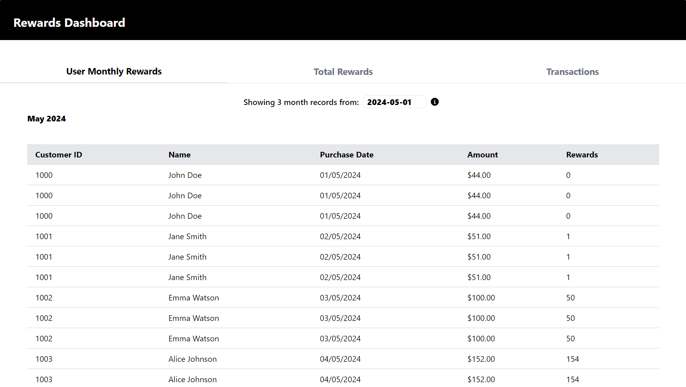
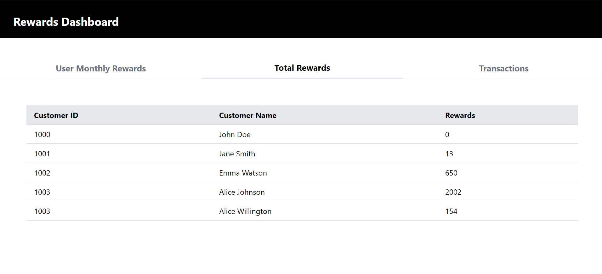
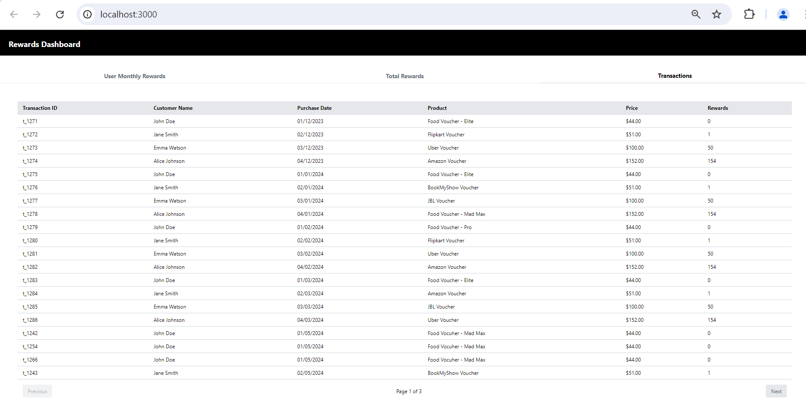
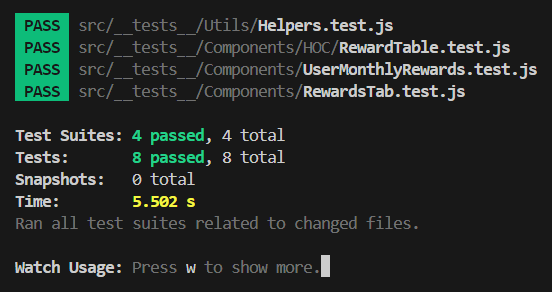

# Simple Rewards Dashboard

This project was bootstrapped with [Create React App](https://github.com/facebook/create-react-app).

#### Ask
A retailer offers a rewards program to its customers, awarding points based on each recorded purchase.

A customer receives 2 points for every dollar spent over $100 in each transaction, plus 1 point for every dollar spent between $50 and $100 in each transaction.

(e.g. a $120 purchase = 2 x $20 + 1 x $50 = 90 points).

#### User Monthly Rewards Table

#### Data unavaibale

#### Shimmer loading view while data is fetched

#### Total Rewards Table

#### Transactions table

#### Tests Status

## Available Scripts

In the project directory, you can run:

### `npm start`

Runs the app in the development mode.\
Open [http://localhost:3000](http://localhost:3000) to view it in your browser.

The page will reload when you make changes.\
You may also see any lint errors in the console.

### `npm test`

Launches the test runner in the interactive watch mode.\
See the section about [running tests](https://facebook.github.io/create-react-app/docs/running-tests) for more information.

### `npm run format`

Runs Prettier and formats code. Can update settigs in `.prettierrc`

### `npm run lint`

Runs the eslinter against the code to check for common bugs and code smells.

